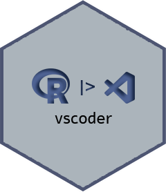

# vscoder 


# Overview

Some functions are provided for the workflow between the R programming language and the VS Code editor.

# Installation

You can install the released version of vscoder from [CRAN](https://CRAN.R-project.org) with:

- CRAN
``` r
# Wait.
```

- Github

Or install the development version of [Github](https://github.com/):
``` r
remotes::install_github("brunofariadf/vscoder")
```

# Usage

This is a basic example that shows how to use a package function.

- R
```r
# version
vscoder::vscode_version()
# [1] "1.69.2"
```

```r
# extension
vscoder::vscode_extension(type = "info")
#                   id           version           license         publisher
# 1  hediet.vscode-dr~              <NA>              <NA>              <NA>
# 2  hediet.vscode-dr~             1.6.4           GPL-3.0 Henning Dieteric~
# 3  julialang.langua~              <NA>              <NA>              <NA>
# 4  julialang.langua~            1.6.28 SEE LICENSE IN L~         julialang
# 5  ms-python.python~         2022.10.1               MIT         Microsoft
# 6  ms-python.vscode~         2022.7.40 SEE LICENSE IN L~         Microsoft
# 7  ms-toolsai.jupyt~ 2022.6.120198181~               MIT         Microsoft
# 8  ms-toolsai.jupyt~             1.0.0               MIT         Microsoft
# 9  ms-toolsai.jupyt~             1.0.9               MIT         Microsoft
# 10 ms-toolsai.jupyt~             1.0.0               MIT         Microsoft
# 11 ms-toolsai.jupyt~             1.0.9               MIT         Microsoft
# 12 ms-vscode.powers~          2022.6.3 SEE LICENSE IN L~         Microsoft
# 13 quarto.quarto-1.~            1.29.0               MIT            Quarto
# 14 reditorsupport.r~             2.5.2 SEE LICENSE IN L~    REditorSupport
#          description
# 1               <NA>
# 2  This unofficial ~
# 3               <NA>
# 4  Julia Language S~
# 5  IntelliSense (Py~
# 6  A performant, fe~
# 7  Jupyter notebook~
# 8  Jupyter keymaps ~
# 9  Renderers for Ju~
# 10 Jupyter keymaps ~
# 11 Renderers for Ju~
# 12 Develop PowerShe~
# 13 Extension for th~
# 14 R Extension for ~
```

# Platform

Development.

<div align="center">

|platform | available |
|:--------|:---------:|
|Windows  |    yes    |
|Linux    |    no     |
|MacOS    |    no     |

</div>

# Code of Conduct

Please note that the project is released with a [Contributor
Code of
Conduct](https://contributor-covenant.org/version/2/0/CODE_OF_CONDUCT.html). By contributing to this project, you agree to abide by its terms.

# License

[MIT](https://github.com/brunofariadf/vscoder/blob/main/LICENSE.md)
